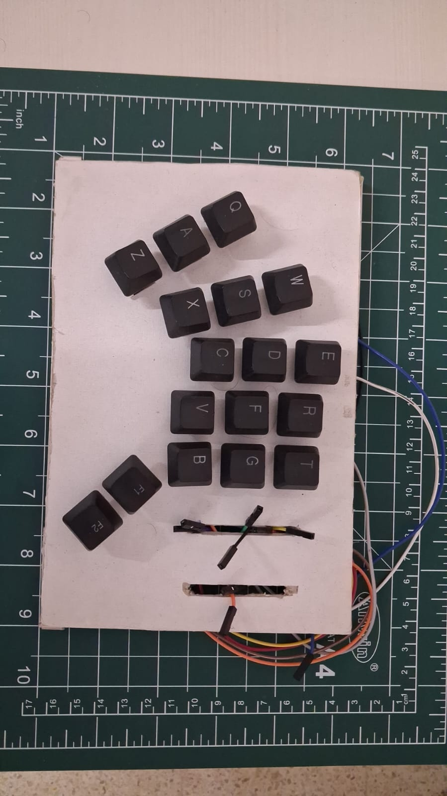
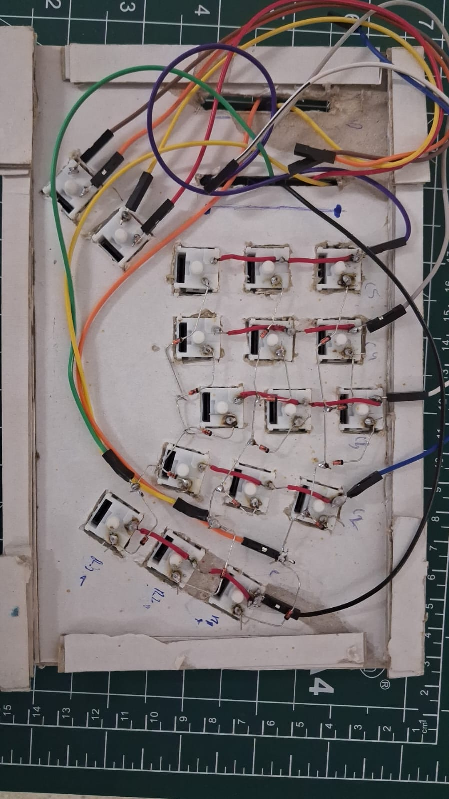
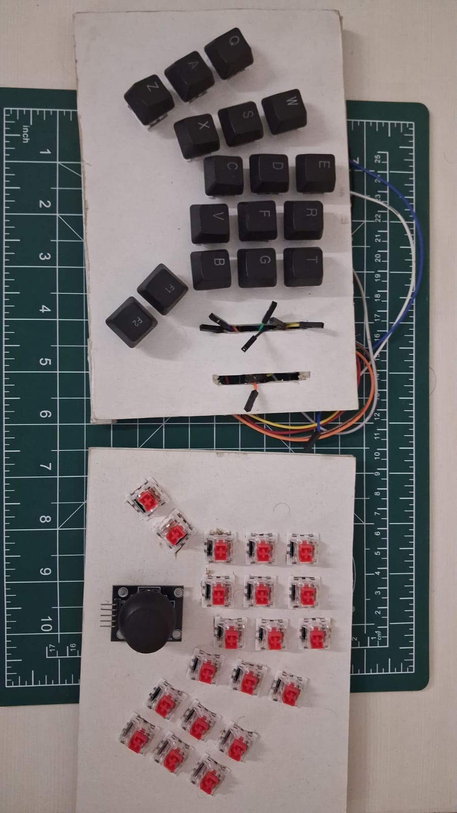

# Split Bluetooth Keyboard (ESP32)

Split mechanical keyboard that uses ESP32 to communicate with the computer through Bluetooth. This repository contains firmware code (Arduino IDE) and build instructions.

**Status:** Firmware for left-hand side is ready and available below, while right-hand firmware is in progress and will be added in further updates.

## Contents

- [Demo](#demo)
- [Bill of Materials](#bill-of-materials)
- [Wiring Guide](#wiring-guide)
- [Installation](#installation)

## Demo

  

## Bill of Materials

Below quantities are per one hand. You will need to double every quantity to build a split keyboard.

| Qty | Part | Notes | Link | Unit Price in rupees|
|-----|------|-------|------|------------|
| 1 | MCU (ESP32) | Any ESP32 dev board should work; you can use Arduino or Pico with some firmware modifications | TBD | ~300 |
| 17 | Mechanical switches | Any switch type can be used but purchase cheaper ones to start with | TBD | ~14 |
| 17 | Keycaps | Salvaged from a trhifted keyboard for this build since it was difficult to find keycaps sets on budget | TBD | ~2 |
| 17+ | Diodes (1N4148 or equivalent) | Purchase a lot of extras so you can restart if you ever make a mistake (learnt from experience) | TBD | ~2 |
| — | Jumper wires | Affordable; purchase extra number of wires than you might need | TBD | ~2 |

*Price estimates are approximate and in local currency*

## Wiring Guide

- [QMK Guide](https://docs.qmk.fm/hand_wire)
- [Useful Vid](https://www.youtube.com/watch?v=hjml-K-pV4E)

## Installation

1. Install [Arduino IDE](https://www.arduino.cc/en/software) and install ESP32 boards support using Board Manager.
2. Clone the repository:
   ```bash
   git clone <repo-url>
   ```
3. Open the sketch for left-hand side in Arduino IDE.
4. Select ESP32 board and proper COM port in Tools menu.
5. Upload the code.
6. Connect and pair the keyboard over Bluetooth in device settings.

Will add instructions for the right-hand side once its built and its firmware is ready.

## Contributing

Issues and PRs are appreciated

